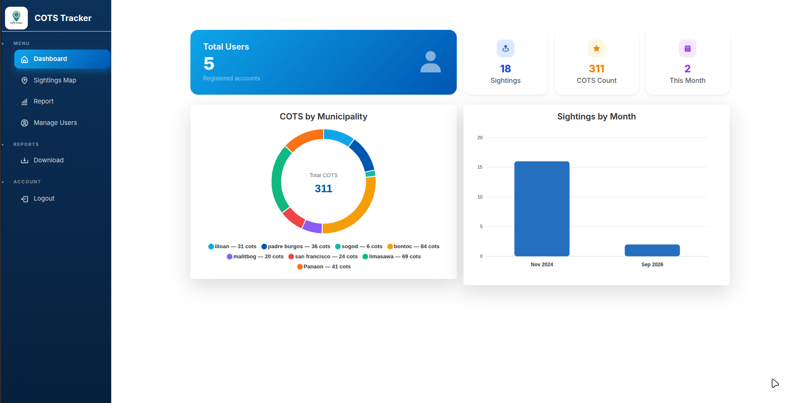
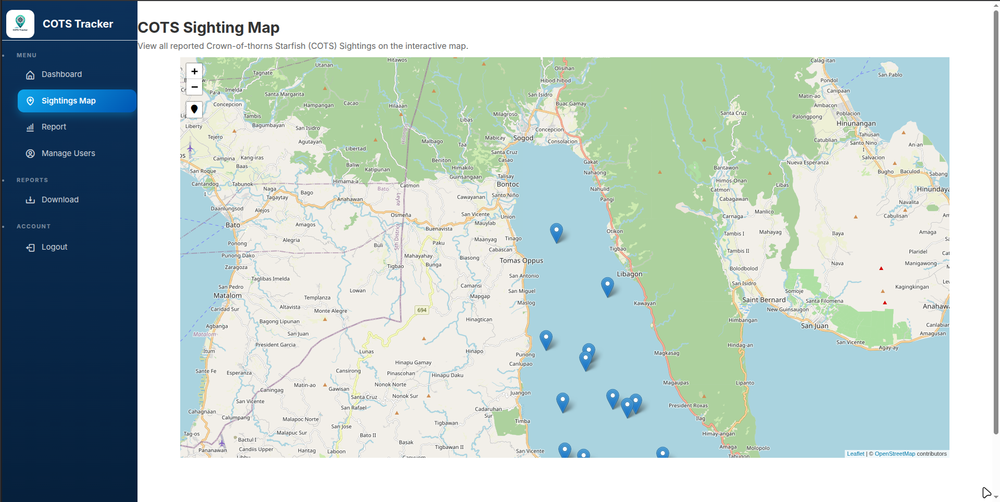
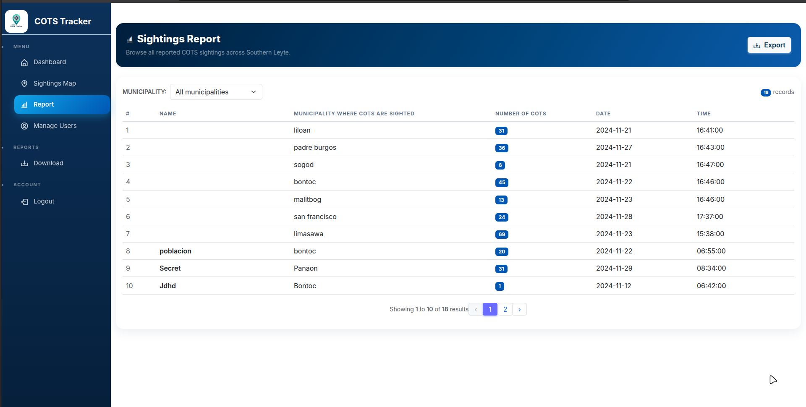
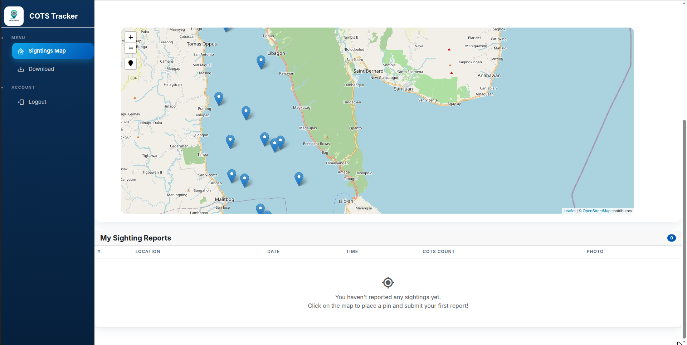
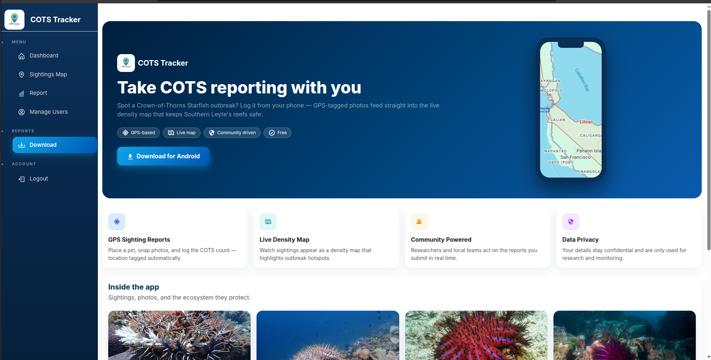
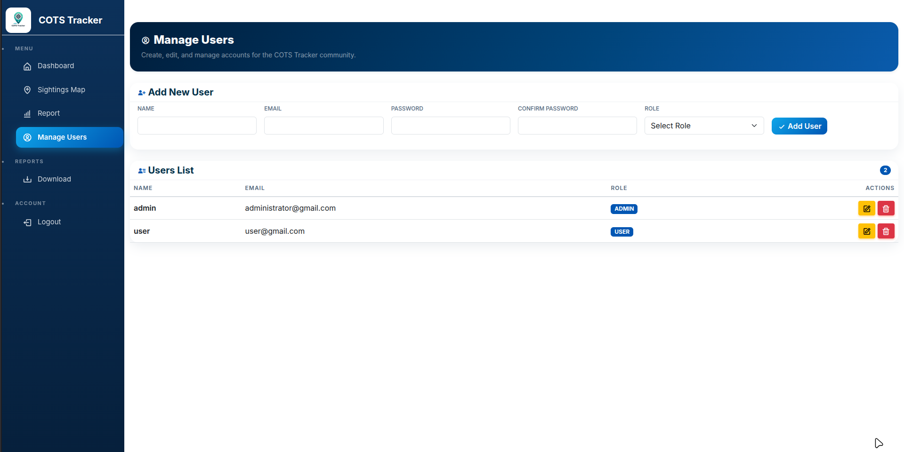

# COTS Tracker

A web application for reporting and mapping **Crown-of-Thorns Seastar (COTS)** sightings in the coastal waters of **Southern Leyte, Philippines**. Sightings are geo-referenced, aggregated into density maps, and exportable as reports so conservation practitioners and local authorities can identify areas needing intervention.

## Features

- **Role-based access** — separate dashboards and permissions for `admin` and `user`.
- **Map reporting wizard** — click the interactive Leaflet map to drop a pin, then submit a sighting through a 4-step guide (details → COTS count → activity/observer → location & media).
- **Population breakdown** — log counts by life stage (early juvenile, juvenile, sub-adult, adult, late adult) with auto-calculated totals.
- **Photo evidence** — attach multiple photos per sighting with inline previews.
- **My sightings** — users track their own reports; admins see everything.
- **Dashboard analytics** — COTS totals by municipality (donut) and monthly trend (bar chart), plus live map filters by municipality and date.
- **Reports & export** — filter sightings by municipality and export to Excel.
- **Geo data** — municipality and barangay options fetched from the PSGC API.
- **Responsive UI** — marine-themed design, collapsible mobile sidebar, works on phones and desktops.

## Screenshots

| Admin dashboard | Sighting report map |
|---|---|
|  |  |

| Report generation | User dashboard |
|---|---|
|  |  |

| Excel export | User management |
|---|---|
|  |  |

## Tech Stack

- **Laravel 10** (PHP 8.1+)
- **MySQL / MariaDB**
- **Blade** templates with **Bootstrap 5** / Sneat admin template
- **Leaflet.js** for maps
- **ApexCharts** for dashboard charts
- **Maatwebsite/Laravel-Excel** for exports
- **Vite** for front-end assets

## Requirements

- PHP >= 8.1 with the `gd`, `zip`, `pdo_mysql`, `mbstring`, and `xml` extensions
- Composer
- Node.js & npm
- MySQL or MariaDB

## Installation

```bash
# 1. Clone the repository
git clone https://github.com/Yajzkie/capstone-project.git
cd capstone-project

# 2. Install PHP dependencies
composer install

# 3. Install front-end dependencies and build assets
npm install
npm run build

# 4. Create the environment file and application key
cp .env.example .env
php artisan key:generate

# 5. Configure your database in .env (DB_DATABASE, DB_USERNAME, DB_PASSWORD),
#    then create the schema and seed the default roles
php artisan migrate

# 6. Link storage for uploaded sighting photos
php artisan storage:link

# 7. Run the application
php artisan serve
```

The app is served at http://127.0.0.1:8000.

## Roles

Roles are seeded by the `create_roles_table` migration:

| Role  | Access |
|-------|--------|
| admin | Dashboard, sightings map, reports & export, user management, municipality management |
| user  | Submit sightings, view map, download reports |

New accounts are created by an admin from the user management page; public registration is disabled.

## License

Developed as an academic capstone project for Southern Leyte State University. The Laravel framework is open-source software licensed under the [MIT license](https://opensource.org/licenses/MIT).
